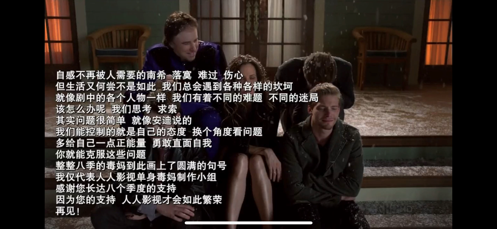

# Weeds
《单身毒妈》（英語：Weeds）是一部由Jenji Kohan創作，於2005年8月8日開播，在Showtime电视台播放的美国电视连续剧。该劇以一名居住在加州市郊的典型美國中產階級婦人為中心，講述她在丈夫死後，為了她與兩個未成年孩子的生計，最後迫于無奈而開始销售大麻的故事，該片於2012年9月16日結束。

劇集最初只是將中產階級生活和毒品世界之間的違和表現出來，但當劇情發展下去時，劇集漸漸開始探討其他問題，包括加州與墨西哥之間的關係等。

